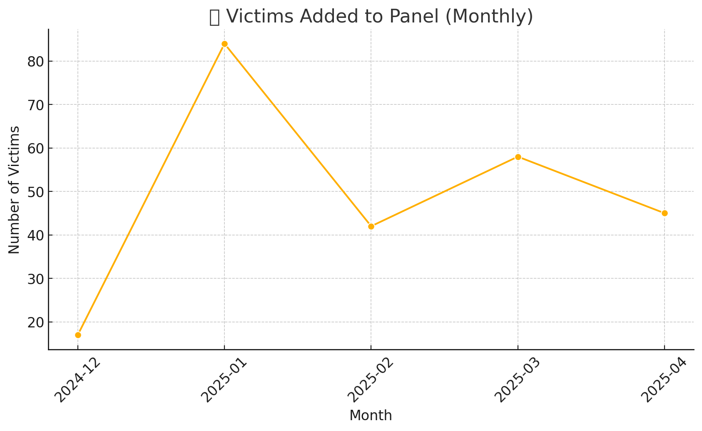

# LockBit Panel Leak – Visual Intelligence Report

This report presents key data-driven insights extracted from LockBit's internal SQL dump (`paneldb`) leaked in May 2025. The following visualizations highlight operational behavior, affiliate activity, and negotiation characteristics observed in the dataset.

---

## 1. Victims Added to the Panel (Monthly)

This chart displays the number of new victims added to the panel each month. Notable peaks may indicate:

- High-performing affiliates
- Coordinated ransomware campaigns
- Shifts in LockBit's targeting or infection methods

---

## MITRE ATT&CK Techniques Observed

Based on behaviors inferred from the dataset and LockBit’s known modus operandi, the following ATT&CK techniques are relevant:

| Tactic                | Technique                                | ID           | Description                                       |
|-----------------------|-------------------------------------------|--------------|---------------------------------------------------|
| Initial Access        | Phishing via Link or Attachment           | T1566.001/002| Email-based infection vectors                    |
| Execution             | Command and Scripting Interpreter         | T1059        | Use of PowerShell or batch scripts               |
| Persistence           | Registry Run Keys / Startup Folder        | T1547.001    | Establishing persistence post-infection          |
| Defense Evasion       | Obfuscated Files or Information           | T1027        | Encrypted payloads or scripts                    |
| Discovery             | System Information Discovery              | T1082        | Mapping target environment before encryption     |
| Impact                | Data Encrypted for Impact                 | T1486        | Ransomware encryption of target data             |
| Impact                | Inhibit System Recovery                   | T1490        | Deletes backups and disables recovery            |
| Exfiltration          | Exfiltration Over Web Protocols           | T1041        | C2 or leak sites used for stolen data            |
| Command and Control   | Application Layer Protocol: Web Protocols | T1071.001    | Panel-based victim monitoring and coordination   |

---

##  About the Dataset

All visualizations were generated from the following sources:

- `clients.csv` – Victim records  
- `users.csv` – Affiliate user metadata  
- `chats.csv` – Negotiation timelines  

This work was conducted as part of [ThreatScroll](https://github.com/Yamilithia/ThreatScroll)
*Prepared by Yamilet Cruz 

